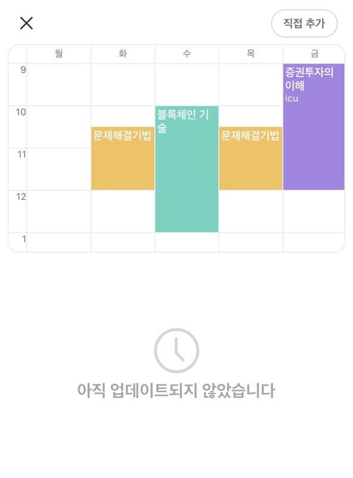

## KauTable, 한국항공대 시간표 생성기

[](http://makeapullrequest.com)
[![Issues][issues-shield]][issues-url]

## 목차

<!-- TABLE OF CONTENTS -->

- [KauTable, 한국항공대 시간표 생성기](#kautable-한국항공대-시간표-생성기)
- [목차](#목차)
- [📷 완성 이미지](#-완성-이미지)
- [🗓 프로젝트 설명](#-프로젝트-설명)
- [⚙️ 사용 기술](#️-사용-기술)
  - [FE](#fe)
- [🏃‍♀️ 기여 준비사항](#️-기여-준비사항)
- [⚡️ 프로젝트 실행](#️-프로젝트-실행)
- [😁 기여 방법](#-기여-방법)
- [기여자 목록](#기여자-목록)
- [프로젝트 저장소 링크](#프로젝트-저장소-링크)

## 📷 완성 이미지

<div style = "flex">
    
    
</div>
<!-- ABOUT THE PROJECT -->

## 🗓 프로젝트 설명

<div style = "flex">
    
    
</div>

항공대 에브리타임의 시간표가 가끔씩 늦게 업데이트되거나, 아예 업데이트되지 않는 문제를 보완하기 위해 제작한 어플리케이션입니다.

## ⚙️ 사용 기술

### FE


## 🏃‍♀️ 기여 준비사항

프로젝트 테스트 및 기여를 위한 소프트웨어를 기술합니다.

- Git
- React.js - ^17.0.1
- Next.js
- Node.js - Node.js 버전 10 이상 (12 또는 14버전을 권장합니다!)

<!-- GETTING STARTED -->

## ⚡️ 프로젝트 실행

프로젝트를 로컬 환경에서 테스트하기 위한 방법을 기술합니다.

1. 프로젝트 포크 후 클론

```
git clone https://github.com/유저네임/kautable.git
```

2. 의존성 파일 설치

```
npm install
```

3. Next.js 프로젝트 실행 (테스트)

```
npm run dev
```

<!-- CONTRIBUTING -->

## 😁 기여 방법

이 시간표 어플리케이션의 데이터는 이렇게 관리됩니다.

1. [종합정보시스템 접속] - [강의시간표 및 계획서 조회] - [두 번째 crossurl.jsp 응답 본문 확인]


2.  획득한 파일을 .txt 파일로 저장하고, [json 파서](https://github.com/Korea-Aerospace-University/kau-subject-parser)를 통해 json으로 파싱

<div style = "flex">
    
    
</div>

3.  파싱한 .json 파일을 `data/학기` 폴더에 `data.json` 이라는 이름으로 입력

4.  데이터 추가 완료!

<!-- CONTACT -->

## 기여자 목록

혹시 어플리케이션 유지보수나 개선에 관심이 있으신 분들은 이슈로 남겨주시면 감사드려요!

- [@c17an](https://github.com/C17AN)

## 프로젝트 저장소 링크

Project Link: [https://github.com/Korea-Aerospace-University/kautable](https://github.com/Korea-Aerospace-University/kautable)

[issues-shield]: https://img.shields.io/github/issues/Korea-Aerospace-University/kautable?style=flat-square
[issues-url]: https://github.com/Korea-Aerospace-University/kautable/issues
